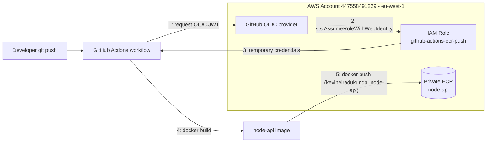

# Push Docker Image to ECR — Node.js + GitHub Actions OIDC

A minimal Node.js API, containerized and shipped to a private Amazon ECR
repository through a GitHub Actions pipeline that authenticates to AWS with
**OIDC only** — no long-lived access keys are stored anywhere.

## Architecture



The IAM role trusts GitHub's OIDC provider only for
`repo:Iradukunda54/docker-ecr-oidc-lab:*` and grants nothing beyond
pushing/pulling layers to the single `node-api` ECR repository — it cannot
touch any other AWS resource.

## Repository layout

```
app/                          Node.js (Express) source
Dockerfile                    Multi-stage, non-root, minimal alpine image
.dockerignore
infrastructure/template.yaml  CloudFormation: ECR repo + OIDC IAM role
.github/workflows/deploy.yml  CI/CD pipeline
```

## Containerization

- Base image: `node:22-alpine` (multi-stage — build deps discarded from
  the final image).
- Runs as the non-root `node` user (built into the official image).
- `npm ci --omit=dev` for reproducible, dependency-pinned installs.
- `HEALTHCHECK` hits `/health`.
- `.dockerignore` excludes `node_modules`, git metadata, CI config, and docs
  from the build context.

## AWS authentication (OIDC, no stored secrets)

Provisioned via [`infrastructure/template.yaml`](infrastructure/template.yaml):

- **ECR repository** `node-api` — image scanning on push, AES256 encryption,
  lifecycle policy expiring untagged images after 7 days and keeping the last
  20 tagged images, tagged with `Project` / `Owner` / `ManagedBy`.
- **IAM role** `github-actions-ecr-push` — trust policy restricted to this
  exact GitHub repository via the `token.actions.githubusercontent.com:sub`
  condition; permission policy limited to `ecr:GetAuthorizationToken` (`*`,
  as required by the action) plus the push/pull actions scoped to the single
  repository ARN. No `ecr:DeleteRepository`, no IAM, no other service.

Deploy/update it with:

```bash
aws cloudformation deploy \
  --template-file infrastructure/template.yaml \
  --stack-name docker-ecr-oidc-lab \
  --capabilities CAPABILITY_NAMED_IAM \
  --parameter-overrides GitHubOrg=Iradukunda54 GitHubRepo=docker-ecr-oidc-lab EcrRepositoryName=node-api Owner=KevineIradukunda \
  --region eu-west-1
```

## CI/CD pipeline

[`.github/workflows/deploy.yml`](.github/workflows/deploy.yml):

1. Triggers on every push to any branch.
2. `permissions: { id-token: write, contents: read }` — the minimum needed
   for OIDC, nothing else.
3. `aws-actions/configure-aws-credentials@v4` assumes
   `arn:aws:iam::447558491229:role/github-actions-ecr-push` via OIDC.
4. `aws-actions/amazon-ecr-login@v2` logs the Docker client into ECR.
5. Builds the image and tags it `kevineiradukunda_node-api` (plus a
   `-<short-sha>` variant for traceability) and pushes both tags.
6. `set -euo pipefail` and no `continue-on-error` anywhere — any failed step
   (build, login, push) aborts the job immediately, so the pipeline fails
   securely rather than silently continuing.

## Deliverables

- GitHub repository: https://github.com/Iradukunda54/docker-ecr-oidc-lab
- Private ECR repository:
  `447558491229.dkr.ecr.eu-west-1.amazonaws.com/node-api`
  (console: ECR → Repositories → `node-api`, region `eu-west-1`)
